# CoreX 組み立てガイド

写真は、トラックボールを遠い側の **J3（D110横）** につなぐ出荷品です。右のファームは書き込み済みなので、そのまま動作確認できます。配布中のJ4用右ファームで上書きしないでください。

純正Cornixの右側を、CoreXの交換基板とトラックボールに組み替えます。左側は分解せず、最後にファームウェアを書き換えます。

[ファームのダウンロード](../README.md#1-ファームをダウンロードする) · [書き込み手順](flashing.md) · [組み立て後の使い方](usage.md)

## 用意するもの

- 純正Cornix
- CoreXの交換基板
- センサー基板を組み込んだトラックボールケース、FPCケーブル、ボール、固定用ネジ2本
- ネジに合うサイズのプラスドライバーと星型ドライバー
- キーキャッププラー、スイッチプラー、ピンセット
- 外したネジを入れる小皿など
- PCと、データ通信できるUSBケーブル

純正のケース、トッププレート、フォーム、バッテリー、スイッチ、キーキャップ、ネジは再利用します。外した部品はまとめて保管してください。

**特に傷めやすいのは、バッテリーコネクターとアルミケースのネジ穴です。** コネクターは配線を引っ張らずに外し、ネジは強く締め込まないでください。バッテリーコネクターを破損した場合の案内は[ページ末尾](#バッテリーコネクターを破損した場合)にあります。

## 1. Cornix右側を分解する

配列を変更している場合は、作業前にVialの **File → Save current layout** で保存しておきます。

1. 電源をOFFにし、USBケーブルを抜きます。
2. 右側のキーキャップ、スイッチ、エンコーダのノブを取り外します。
3. ドライバーを使い分けて、ケースのネジをすべて外します。**1か所はシールに隠れているので、シールを剥がして外してください。**
4. 先にマイコンカバーを持ち上げ、その後トッププレートを持ち上げて外します。

すっと持ち上がらない場合は、ネジが残っていないか確認してください。無理にこじ開けず、基板につながっているバッテリーの配線にも余裕を持たせます。

  <a href="images/assembly/IMG_3784.jpg">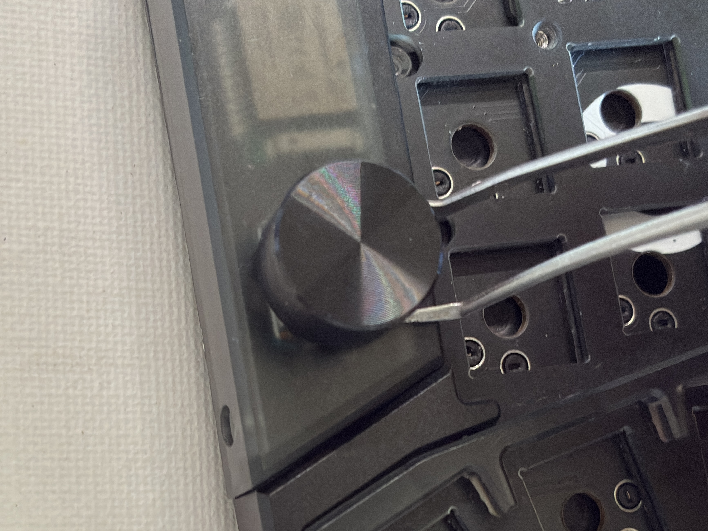</a>
  <a href="images/assembly/IMG_3786.jpg">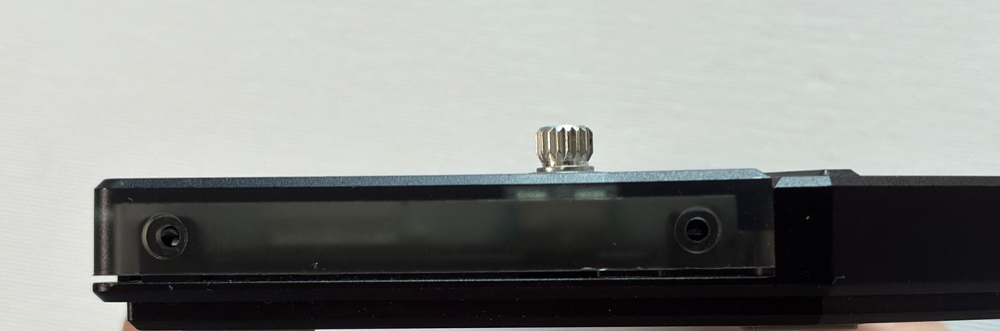</a>

エンコーダのノブ ／ マイコンカバー側面のネジ穴

## 2. バッテリーを外し、純正基板を保管する

1. バッテリーにつながるコネクターを確認します。
2. ピンセットなどで、**ケーブル側のコネクターの樹脂部分**をつかみ、ゆっくり抜きます。配線を引っ張ったり、基板側のソケットをこじったりしないでください。ピンセットを金属端子に触れさせないようにします。
3. 純正基板を取り出します。CoreXの交換基板を袋から出し、その袋に純正基板を入れて保管します。

純正基板は裸のまま置かないでください。他の物に当たると、小さな部品が外れたり傷ついたりすることがあります。

  <a href="images/assembly/IMG_3789_clean.jpg">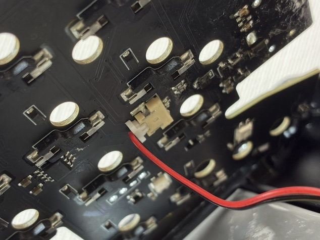</a>
  <a href="images/assembly/IMG_3790_clean.jpg">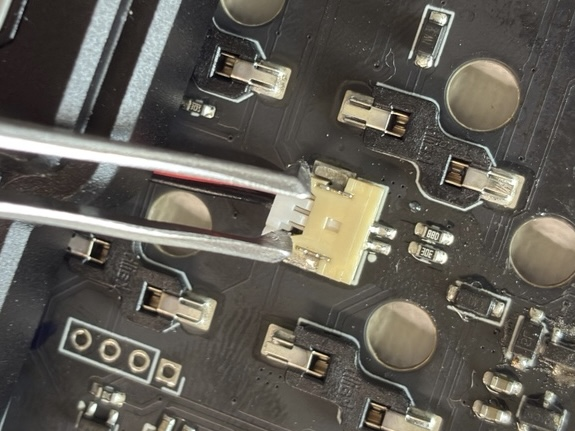</a>

バッテリーの接続位置 ／ 配線ではなく樹脂部分をつかむ

  <a href="images/assembly/IMG_3791_clean.jpg">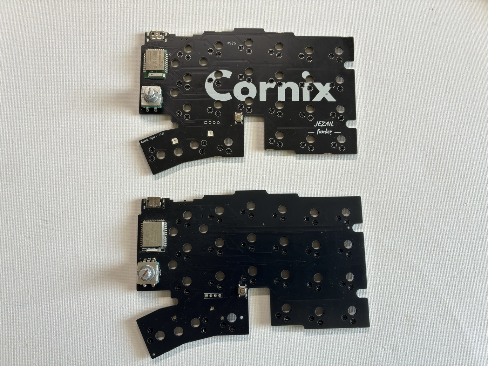</a>

上が純正基板、下がCoreXの交換基板

## 3. フォームとトッププレートを仮固定する

1. CoreXの交換基板に、トッププレート下のフォームを重ねます。
2. その上にトッププレートを重ね、スイッチの穴を合わせます。
3. 四隅のスイッチを先に取り付けて、基板・フォーム・トッププレートを仮固定します。フォームがずれたり、折れ込んだりしていないか確認します。

  <a href="images/assembly/IMG_3792_clean.jpg">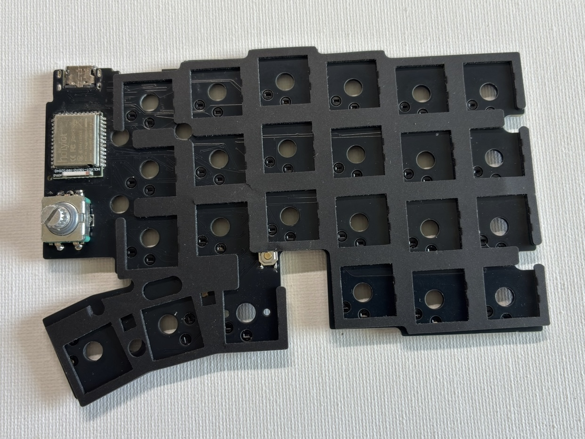</a>
  <a href="images/assembly/IMG_3793_clean.jpg">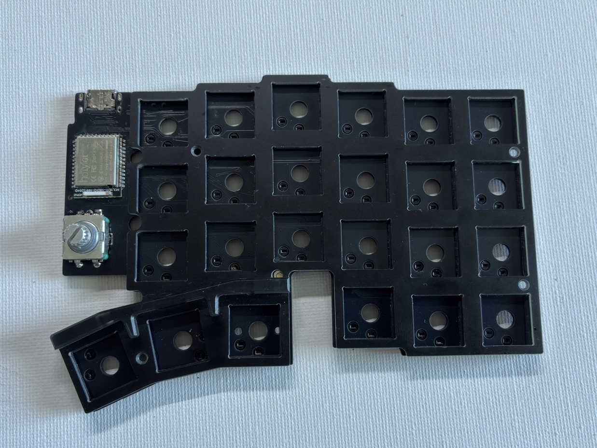</a>

① 基板にフォームを重ねる ／ ② トッププレートを重ねる

  <a href="images/assembly/IMG_3794_clean.jpg">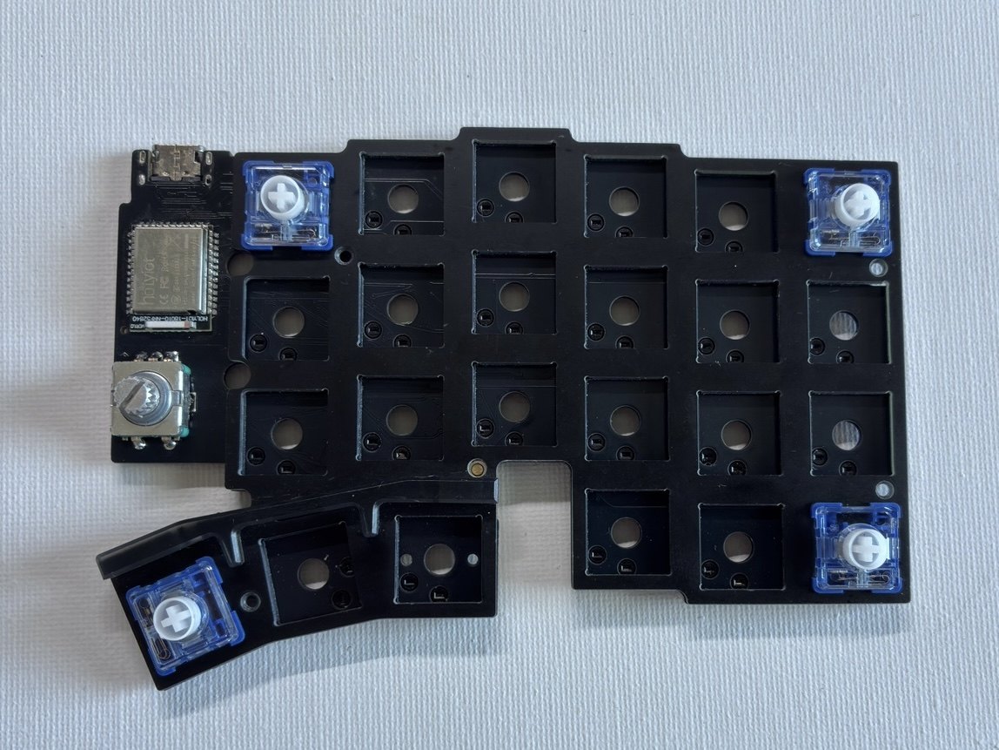</a>

③ 四隅のスイッチで仮固定する

## 4. トラックボールのケーブルを接続する

この作業中はUSBとバッテリーを外したままにします。FPCは、トラックボールケースから出ている薄い平たいケーブルです。

1. FPCケーブルを、トッププレートの穴から基板の穴へ通し、基板の裏側へ出します。ケースをケーブルでぶら下げないよう、手で支えてください。
2. **ボールから遠い側のJ3コネクター**（「D110」の横）を確認します。
3. 茶色のストッパーを、ピンセットなどでそっと上げます。コネクター本体を持ち上げないようにしてください。
4. コネクターのある基板面を上に向け、**FPCの金属端子が露出している面を下（基板側）に向けて**、まっすぐ奥まで差し込みます。
5. ストッパーを下げてケーブルを固定します。斜めに入っていたり、途中までしか入っていない状態で閉じないでください。

ストッパーは小さく壊れやすいため、閉じたままケーブルを押し込んだり、強く引き抜いたりしないでください。

  <a href="images/assembly/IMG_3795_clean.jpg">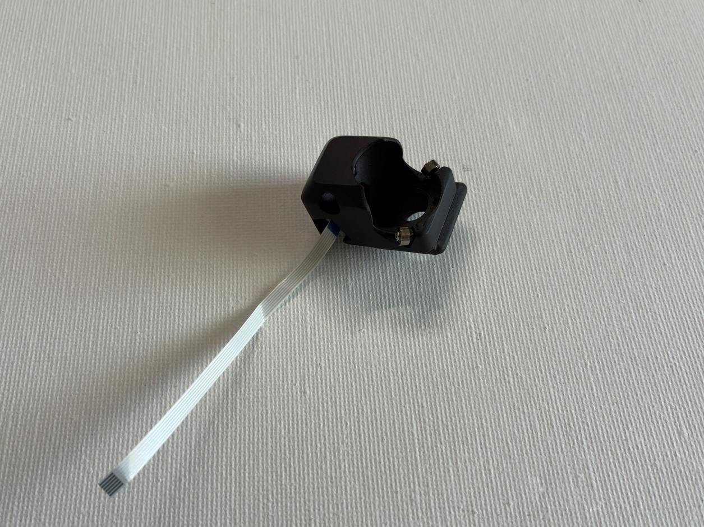</a>
  <a href="images/assembly/IMG_3796_clean.jpg">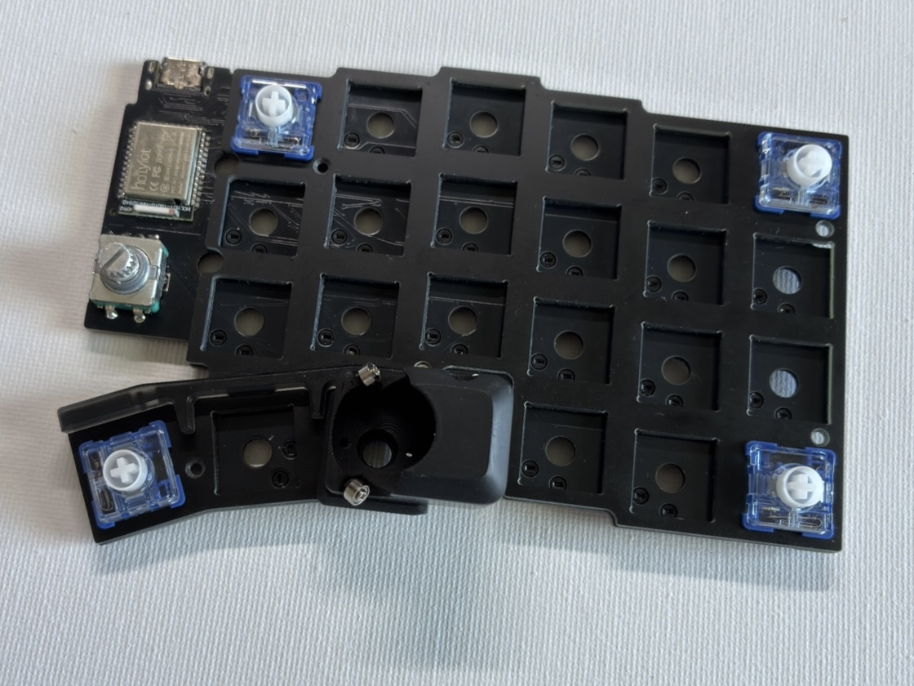</a>

ケースから出ているFPCケーブル ／ トラックボールケースを置く位置

  <a href="images/assembly/IMG_3797_clean.jpg">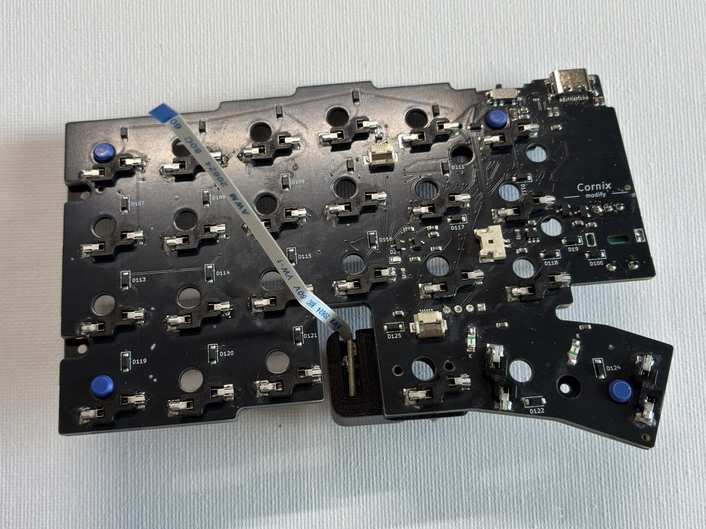</a>

穴から裏へ通し、遠い側のJ3へ向ける

  <a href="images/assembly/IMG_3798_clean.jpg">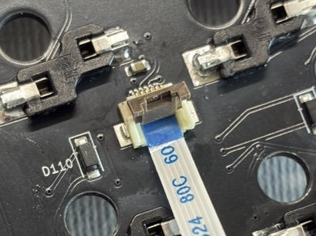</a>
  <a href="images/assembly/IMG_3799_clean.jpg">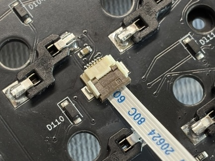</a>

① ストッパーを上げて差し込む ／ ② ストッパーを下げて固定する

**J4接続の基板を使う場合：** 接続先は親指側のD125横です。右ファームもJ4用を使います。J3とJ4は、ケーブルの差し替えだけでは切り替えられません。

## 5. USBでトラックボールの動作を確認する

トラックボールケースをネジで固定する前に確認します。基板は金属に触れない場所へ置き、バッテリーはまだ接続しません。

1. 右基板をPCにUSB接続します。
2. 出荷品は右のファームを書き込み済みです。USB接続後、数秒待ちます。J4接続の基板でまだ書き込んでいない場合のみ、[J4用右ファームの書き込み手順](flashing.md)へ進んでください。
3. 起動したらボールをケースに入れて回し、PCのポインターが動くことを確認します。
4. 動作を確認できたら、USBケーブルを抜きます。

  <a href="images/assembly/IMG_3802_clean.jpg">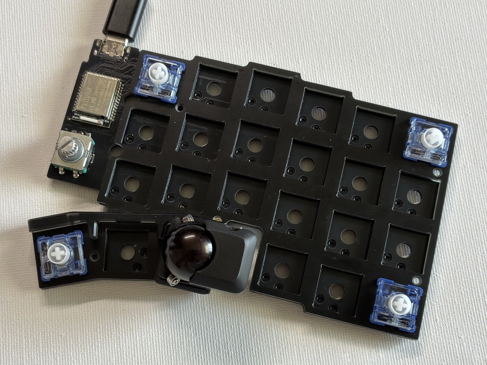</a>

ケースを閉じる前に、USB接続でボールの動作を確認する

動かない場合は、下の項目を確認してから先へ進みます。**ケーブルやセンサー基板を触る前に、USBを抜いてください。**

### トラックボールが動かない場合

- **交換基板側のFPC接続：** 端子の向き、差し込みの深さ、ストッパーが閉じているかを確認します。
- **センサー基板の位置：** センサー基板はケースに入れた状態で出荷します。ケーブルを強く引くと位置がずれることがあるため、浮いている場合は基板本体をそっと押して、ケースの奥まで戻します。
- **センサー基板側のFPC接続：** ケーブルが抜けていたら、小さなコネクターのストッパーを上げ、元の向きで差し込み直します。奥まで入れたらストッパーを下げます。元の向きが分からない場合は、無理に差し込まず、配布・購入時の連絡先へご連絡ください。

センサー基板とコネクターはとても小さいので、ケーブルで引っ張らず、基板本体を支えて扱ってください。確認後にUSBをつなぎ直し、もう一度ボールを回します。

  <a href="images/assembly/extra_01_small_board_ribbon_clean.jpg">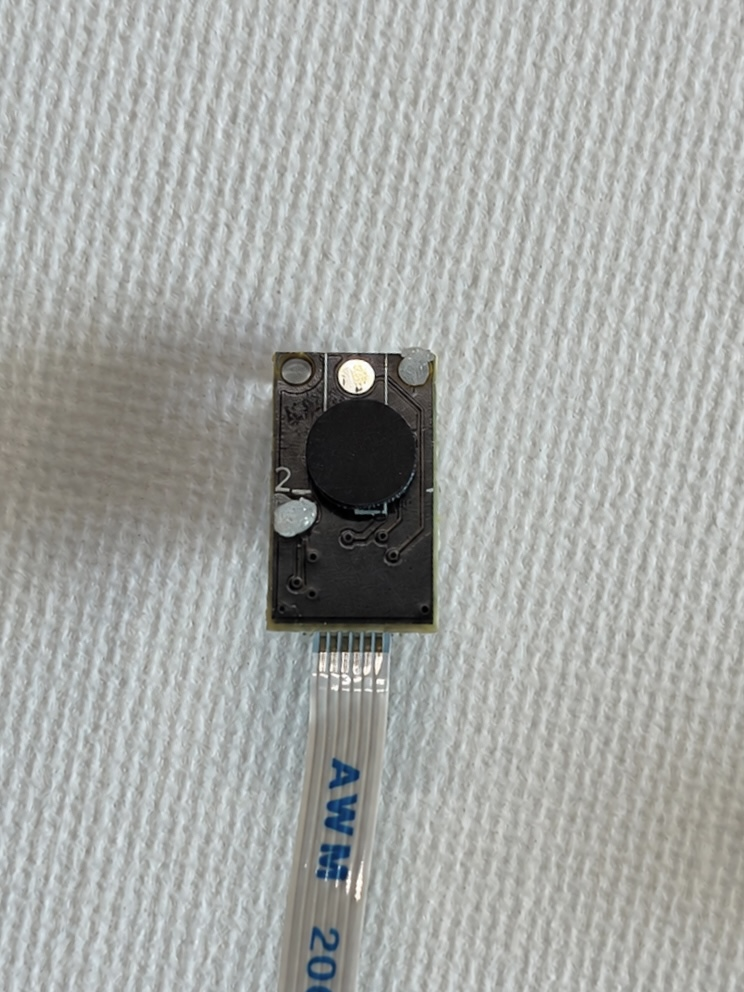</a>
  <a href="images/assembly/extra_02_transparent_module_clean.jpg">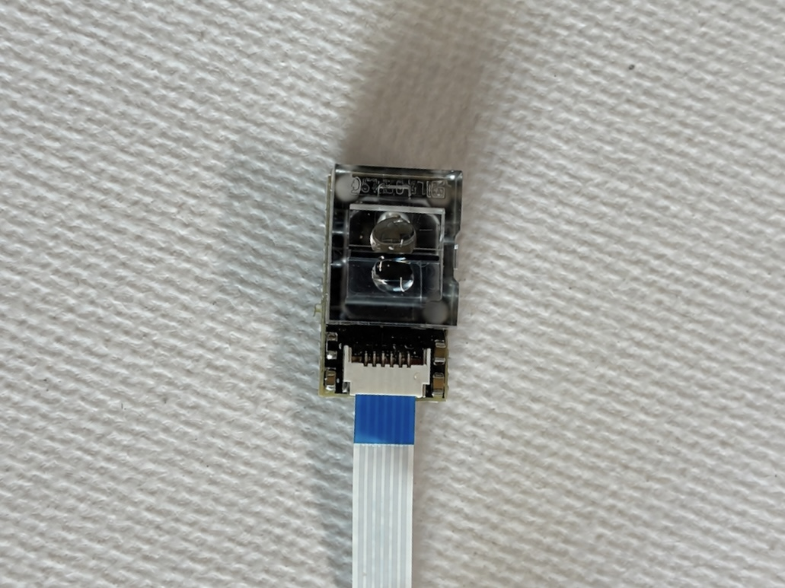</a>

センサー基板の裏側 ／ レンズ側から見たFPCの向き

  <a href="images/assembly/IMG_3810.jpg">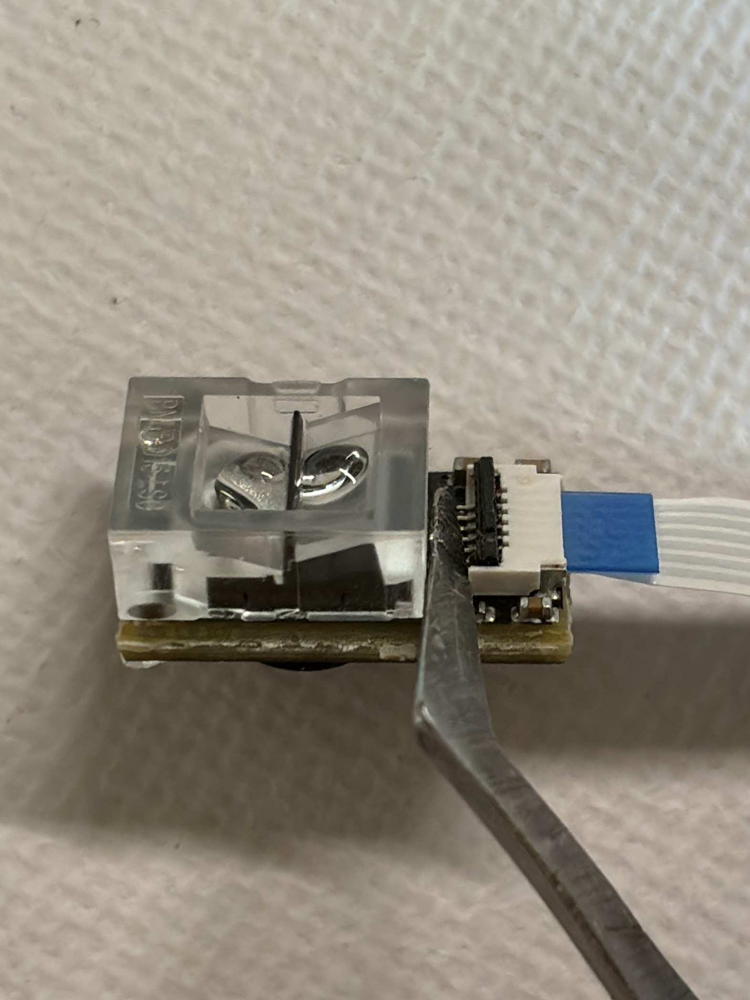</a>

センサー側もストッパーを上げてから抜き差しする

## 6. ケースを固定し、バッテリーを接続する

1. USBを抜いた状態で、トラックボールケースを**基板の裏からネジ2本**で固定します。ケーブルを挟まず、無理に引っ張られない位置に収めます。
2. 一度USBをつなぎ、固定後もボールが動くことを確認します。確認したらUSBを抜きます。
3. バッテリーのコネクターをCoreX基板に差し込みます。純正Cornixと同じ極性です。元と同じ向きで、無理な力をかけずに接続してください。
4. USBをつなぎ、充電中に基板裏の赤い充電LEDが点灯することを確認します。満充電などで充電していないときは、点灯しない場合があります。
5. 確認が済んだら、USBを抜き、電源をOFFにしてからケースへ戻します。

  <a href="images/assembly/IMG_3800_clean.jpg">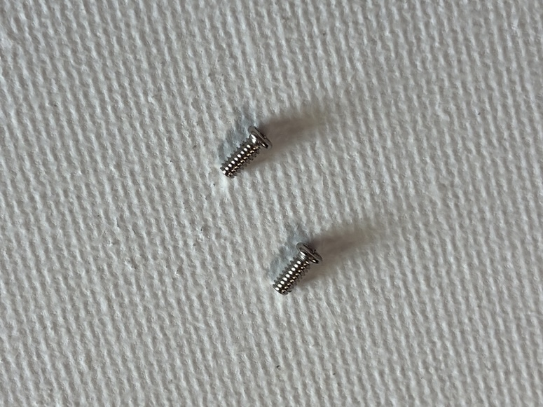</a>
  <a href="images/assembly/IMG_3801_clean.jpg">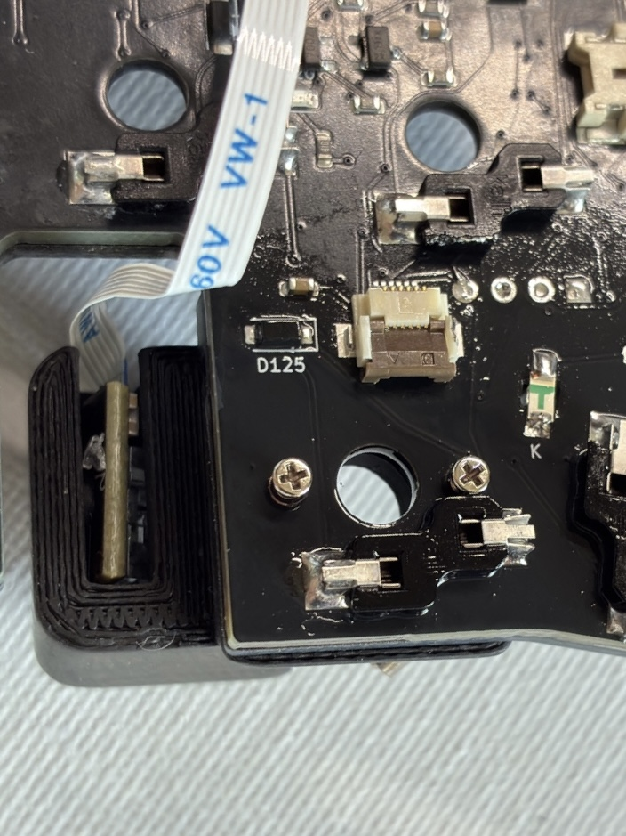</a>

固定に使うネジ2本 ／ 基板の裏からケースを固定する

写真のD125横のコネクターはJ4です。今回のJ3接続では使わず、空いたままにします。

## 7. アルミケースに戻す

1. スライドスイッチカバーの内側のくぼみと、基板のスライドスイッチの位置を合わせます。スイッチは壊れやすいので、ずれたまま基板を押し込まないでください。
2. バッテリーの配線を収めながら、仮固定した基板・フォーム・トッププレートをケースにセットします。配線が浮いていたら、挟み込まない位置へそっと押さえて収めます。
3. 基板やプレートに浮きがないことを確認し、マイコンカバーを戻して上からネジ留めします。
4. 残りのスイッチとキーキャップを取り付けます。

**浮いた基板を、ネジの力で押し下げないでください。** スイッチカバー、バッテリーの配線、FPCケーブルの位置を先に確認します。

ネジは部品が動かなくなる程度に締め、強く締め込まないでください。アルミケースのネジ穴を傷めると、そのままでは固定できなくなります。

  <a href="images/assembly/IMG_3803_clean.jpg">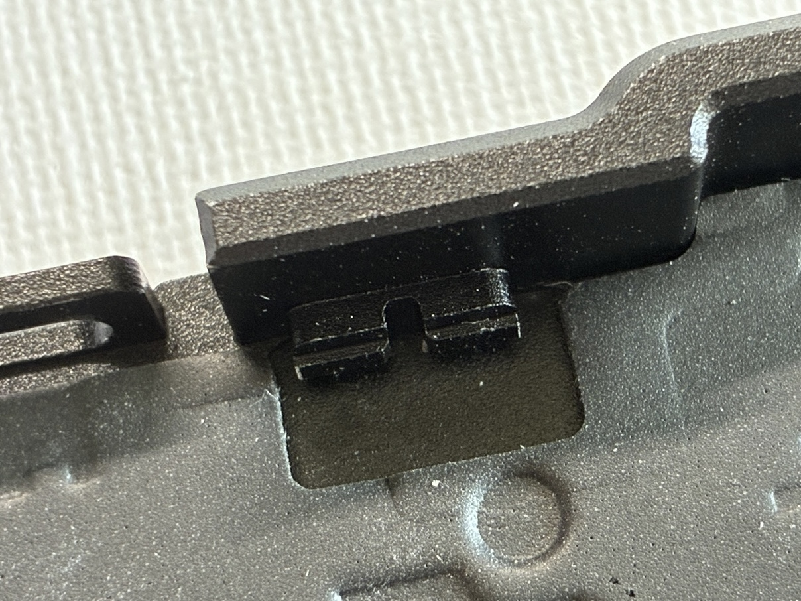</a>
  <a href="images/assembly/IMG_3807_clean.jpg">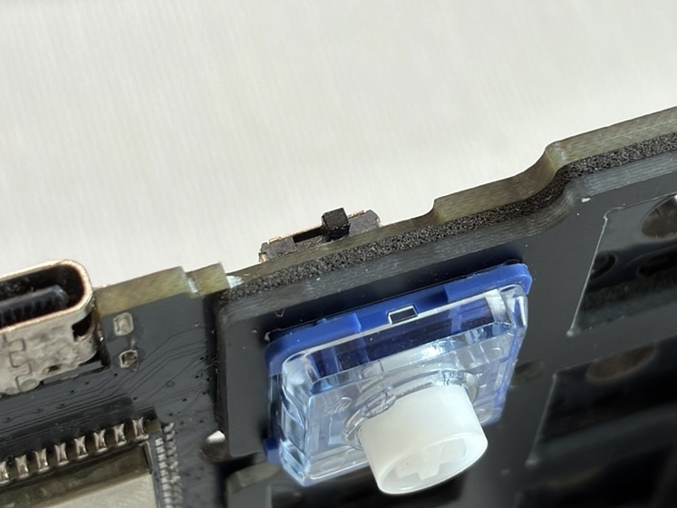</a>

ケース内側のスイッチカバーのくぼみ ／ このスライドスイッチと位置を合わせる

  <a href="images/assembly/IMG_3805_clean.jpg">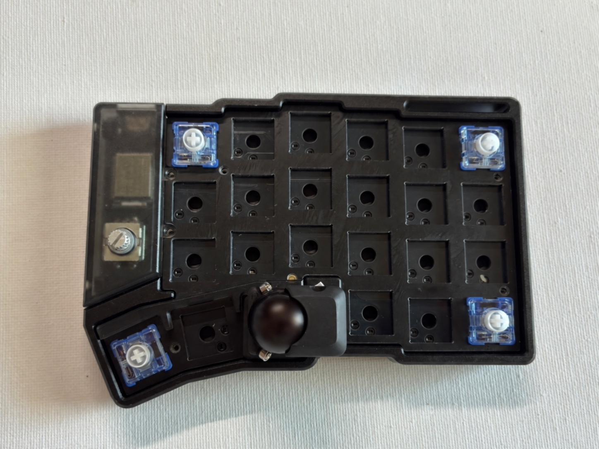</a>
  <a href="images/assembly/IMG_3808_clean.jpg">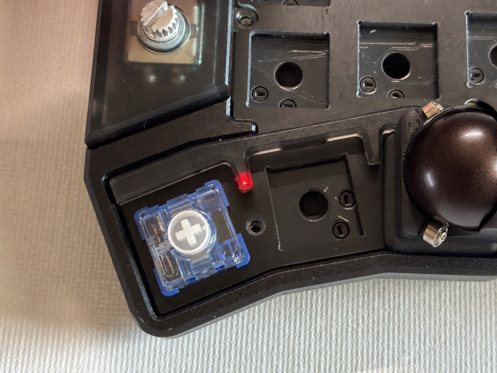</a>

ケースとマイコンカバーを戻した状態 ／ 親指側のLED周辺とトラックボールの収まり

## 8. 左側を書き換え、左右を接続する

1. [純正Cornix左への書き込み手順](flashing.md#純正-cornix-左を初めて使う)に沿って、純正の設定を保存してから左用ファームを書き込みます。出荷品の右は書き込み済みなので、書き直す必要はありません。
2. [左右のペアリング](../README.md#3-左右をペアリングする)を進め、左右のキーで文字を入力できることを確認します。
3. Bluetoothで使う場合は、続けて[PCとのペアリング](../README.md#4-pcとbluetoothでペアリングする)を進めます。
4. [操作確認](../README.md#5-操作を確認する)に沿って、キー、ボール、クリック、スクロールを試します。

これで組み立ては完了です。おつかれさまでした。

## バッテリーコネクターを破損した場合

バッテリーコネクターは国内での入手が難しい部品です。ちぎれたり破損した場合は、作業を止めて、配布・購入時の連絡先へご連絡ください。交換品を用意します。
